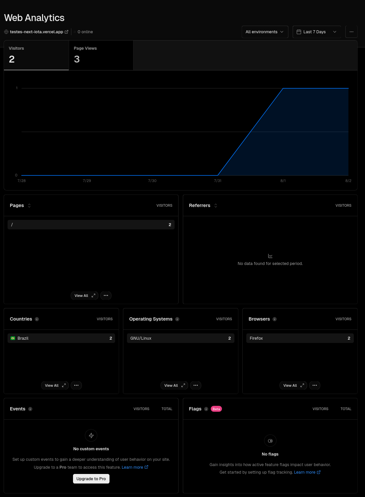
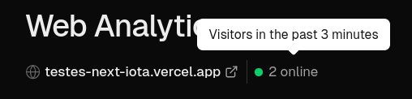

Repositório para testes com o uso do Next.js e hospedagem na Vercel e outros ambientes.

Para usar as variáveis de ambiente, crie um arquivo `.env.local` na raiz do projeto contendo valores para as variáveis possíveis conforme [`.env.example`](.env.example).

## Analytics

Branch: [`analytics`](https://github.com/Rafatcb/testes-next/tree/analytics).

### Vercel Analytics

Para usar o [Analytics da Vercel](https://vercel.com/docs/analytics) em React, basta habilitá-lo no seu projeto da Vercel, instalar o pacote `@vercel/analytics` e importar o componente e usá-lo, por exemplo:

```jsx
import { Analytics } from '@vercel/analytics/react';

function Componente {
  return (
    <div>
      <Analytics />
      <p>Meu componente.</p>
    </div>
  );
}
```

Esse componente fará uma requisição `GET /_vercel/insights/script.js` que contém o script para realizar as requisições de analytics, como `POST /_vercel/insights/view` ou `POST /_vercel/insights/event`.

A visualização dos dados na Vercel é desta forma:



A Vercel conta como "online" os visitantes dos últimos três minutos:



### Solução própria

Inspirado pelo artigo [_How to save $13.27 on your sAAs bill_](https://dgerrells.com/blog/how-to-save-13-27-on-your-saas-bill), decidi testar uma implementação própria do analytics. Para isso, o cliente precisa enviar um `POST` com os dados que desejamos salvar para uma API, e a API irá tratar os dados e armazená-los, podendo obter ainda mais dados pelos cabeçalhos da requisição.

No cliente, podemos criar um hook [`useAnalytics`](./app/hooks/useAnalytics.tsx), com o uso do `useEffect` para realizar o log inicial de visita à página. Esse é o mais relevante. O artigo mencionado usa outros logs, como o de abandono do site ou retorno. Usar esses dois momentos diferentes permite identificar por quanto tempo cada visitante ficou e quantas visitas a página recebeu. Também é um modo mais preciso de calcular a quantidade de visitantes onlines do que o da Vercel, que apenas conta as visitas dos últimos 3 minutos.

Ao encapsular o `useAnalytics` em um componente [`Analytics`](./app/components/Analytics.tsx), como no código abaixo, poderemos utilizá-lo normalmente num React Server Component, da mesma forma que o `Analytics` da Vercel é utilizado.

```jsx
'use client';
import { useAnalytics } from '../hooks/useAnalytics';

export function Analytics() {
  useAnalytics();

  return null;
}
```

Para conseguir enviar a requisição ao sair da página, o artigo utilizou o [`navigator.sendBeacon`](https://developer.mozilla.org/en-US/docs/Web/API/Navigator/sendBeacon) (veja quais dispositivos suportam esse método no [caniuse](https://developer.mozilla.org/en-US/docs/Web/API/Navigator/sendBeacon)). Na documentação do MDN, descobrimos algumas coisas:

1. Não há garantia de que o navegador enviará um `fetch` ao sair da página, por isso podemos usar o `navigator.sendBeacon`, pois os dados são transmitidos de forma assíncrona quando o agente do usuário (navegador) tem a oportunidade de fazê-lo.
2. Para enviar os dados no fim da sessão, a forma mais confiável é por meio do evento `visibilitychange`, com um fallback para o evento `pagehide`.

Dadas as limitações acima em relação ao `sendBeacon` e ao uso do `visibilitychange`, não é certo que conseguiremos realizar o log do analytics no abandono da página, então é preciso verificar na prática se os fallbacks funcionam bem para que possamos obter a quantidade de visitantes online e o tempo que cada visitante ficou na página, mas limitar a janela de tempo analisada é um bom fallback (algo similar ao que a Vercel faz).

Do lado do servidor, precisamos apenas de uma API que armazene os dados desejados e alguma forma para recuperá-los e exibir de maneira gráfica, como em outros serviços de analytics. Esses dados podem ficar num banco de dados próprio, em uma VPS, como foi mencionado no artigo, ou no [Tinybird](https://tinybird.co), que é um serviço que a Vercel usa para o Analytics (ou seja, substituir a Vercel pelo Tinybird pode ser uma possibilidade para reduzir os custos).

O Tinybird possui gráficos na própria plataforma, e também é possível executar consultas SQL na área "playground", então não é necessário construir uma interface, caso você opte por usar esse serviço. Eu optei por criar uma página [/analytics](./app/analytics/page.tsx), como um substituto simplificado do Analytics da Vercel. Como os dados estão sob nosso controle, temos a flexibilidade em escolher quais dados escolher e quais filtros disponibilizar.

No artigo, o autor criou uma função na Vercel para servir como rota, que irá receber os dados do cliente e enviar para a API da VPS, que é responsável pelo armazenamento. Dessa forma, a URL de analytics no VPS permanece secreta. Mesmo que optemos por continuar usando o ambiente da Vercel para essa nova rota da API, a [precificação de funções](https://vercel.com/docs/functions/usage-and-pricing) é bem mais barata do que a de [analytics](https://vercel.com/docs/analytics/limits-and-pricing).

Além da economia financeira, podemos ter acesso à mais dados e por mais tempo. Optar por um VPS ao invés do Tinybird pode trazer uma economia ainda maior, dependendo do seu nível de uso. Para evitar possíveis abusos, trate os dados no servidor que foram recebidos pelo cliente. Se for necessário liberar espaço por causa do tamanho do banco de dados, é possível agregar os dados antigos numa tabela separada, e/ou extrair para outro lugar mais barato, como o S3, caso não queira perder os dados originais.

Para realizar a integração com o Tinybird, adaptei o guia do artigo [_Building a Real-Time Analytics Dashboard with Next.js, Tinybird, and Tremor: A Comprehensive Guide_](https://dev.to/mfts/building-a-real-time-analytics-dashboard-with-nextjs-tinybird-and-tremor-a-comprehensive-guide-15k0) e também consultei a [documentação oficial](https://www.tinybird.co/docs/).
